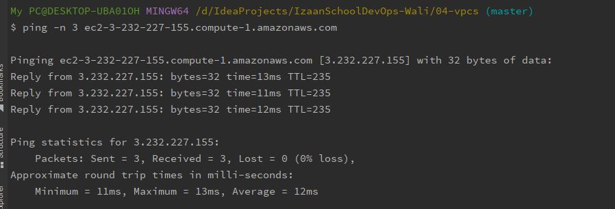
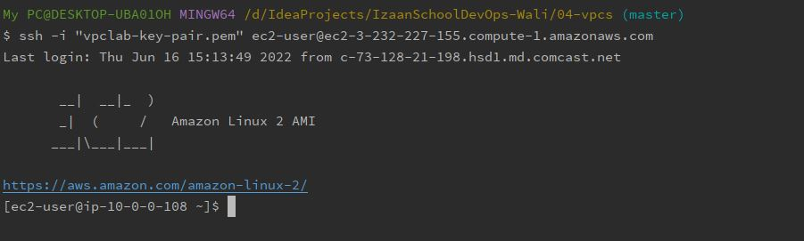

# Topic 4: Virtual Private Clouds (VPCs)

<!-- TOC -->

- [Topic 4: Virtual Private Clouds (VPCs)](#topic-4-virtual-private-clouds-vpcs)
  - [Lesson 4.1: Creating Your Own VPC](#lesson-41-creating-your-own-vpc)
    - [Principle 4.1](#principle-41)
    - [Practice 4.1](#practice-41)
      - [Lab 4.1.1: New VPC with "Private" Subnet](#lab-411-new-vpc-with-private-subnet)
      - [Lab 4.1.2: Internet Gateway](#lab-412-internet-gateway)
      - [Lab 4.1.3: EC2 Key Pair](#lab-413-ec2-key-pair)
      - [Lab 4.1.4: Test Instance](#lab-414-test-instance)
        - [Question: Post Launch](#question-post-launch)
        - [Question: Verify Connectivity](#question-verify-connectivity)
      - [Lab 4.1.5: Security Group](#lab-415-security-group)
        - [Question: Connectivity](#question-connectivity)
      - [Lab 4.1.6: Elastic IP](#lab-416-elastic-ip)
        - [Question: Ping](#question-ping)
        - [Question: SSH](#question-ssh)
        - [Question: Traffic](#question-traffic)
      - [Lab 4.1.7: NAT Gateway](#lab-417-nat-gateway)
        - [Question: Access](#question-access)
        - [Question: Egress](#question-egress)
        - [Question: Deleting the Gateway](#question-deleting-the-gateway)
        - [Question: Recreating the Gateway](#question-recreating-the-gateway)
      - [Lab 4.1.8: Network ACL](#lab-418-network-acl)
        - [Question: EC2 Connection](#question-ec2-connection)
    - [Retrospective 4.1](#retrospective-41)
  - [Lesson 4.2: Integration with VPCs](#lesson-42-integration-with-vpcs)
    - [Principle 4.2](#principle-42)
    - [Practice 4.2](#practice-42)
      - [Lab 4.2.1: VPC Peering](#lab-421-vpc-peering)
      - [Lab 4.2.2: EC2 across VPCs](#lab-422-ec2-across-vpcs)
        - [Question: Public to Private](#question-public-to-private)
        - [Question: Private to Public](#question-private-to-public)
      - [Lab 4.2.3: VPC Endpoint Gateway to S3](#lab-423-vpc-endpoint-gateway-to-s3)
    - [Retrospective 4.2](#retrospective-42)
      - [Question: Corporate Networks](#question-corporate-networks)
  - [Further Reading](#further-reading)

<!-- /TOC -->

## Lesson 4.1: Creating Your Own VPC

### Principle 4.1

*VPCs provide isolated environments for running all of your AWS
services. Non-default VPCs are a critical component of any safe
architecture.*

### Practice 4.1

This section walks you through the steps to create a new VPC. On every
engagement, you'll be working in VPCs created by us or the client. Never
use EC2 Classic or the default VPC.

This is a complicated set of labs. If you get stuck, take a look at the
example template in the
[AWS::EC2::VPCPeering](https://docs.aws.amazon.com/AWSCloudFormation/latest/UserGuide/aws-resource-ec2-vpcpeeringconnection.html)
doc. It gives you a lot of info, but you can use it to see how resources
are tied together. The AWS docs also provide a
[VPC template sample](https://s3.amazonaws.com/cloudformation-templates-us-east-1/vpc_single_instance_in_subnet.template)
that may be useful.

#### Lab 4.1.1: New VPC with "Private" Subnet

Launch a new VPC via your AWS account, specifying a region that will be
used throughout these lessons.

- Use a [CloudFormation YAML template](https://docs.aws.amazon.com/AWSCloudFormation/latest/UserGuide/template-reference.html).

- Assign it a /16 CIDR block in [private IP space](https://docs.aws.amazon.com/AmazonVPC/latest/UserGuide/VPC_Subnets.html#VPC_Sizing),
  and provide that block as a stack parameter in a [[separate parameters.json
  file]](https://aws.amazon.com/blogs/devops/passing-parameters-to-cloudformation-stacks-with-the-aws-cli-and-powershell).

- Create an EC2 subnet resource within your CIDR block that has a /24
  netmask.

- Provide the VPC ID and subnet ID as stack outputs.

- Tag all your new resources with:

  - the key "user" and your AWS user name;
  - "izaan-lesson" and this lesson number;
  - "izaan-lab" and this lab number.

- Don't use dedicated tenancy (it's needlessly expensive).

```yaml
Description: This Template creates VPC with "Private" subnet. Then it added, attached an internet gateway along with a route table to allow traffic to and from instances.

Parameters:
  VpcCIDR:
    Description: Please enter the IP range for this VPC
    Type: String

  PrivateSubnet1CIDR:
    Description: 251 private IP addresses for us-east-1a
    Type: String

Resources:
  # Create VPC
  VPC:
    Type: AWS::EC2::VPC
    Properties:
      CidrBlock: !Ref VpcCIDR
      EnableDnsHostnames: true
      EnableDnsSupport: true
      InstanceTenancy: default
      Tags:
        - Key: Name
          Value: Assignment-VPC
        - Key: user
          Value: Admin
        - Key: izaan-lesson
          Value: lesson 4.1
        - Key: izaan-lab
          Value: lab 4.1.1

  # DATA FOR PRIVATE SUBNET1 & INTERNET GATEWAY
  # Create Private Subnet1
  PrivateSubnet1:
    Type: AWS::EC2::Subnet
    Properties:
      AvailabilityZone: us-east-1a
      CidrBlock: !Ref PrivateSubnet1CIDR
      MapPublicIpOnLaunch: false
      Tags:
        - Key: Name
          Value: Assignment-Private-Subnet-1
        - Key: user
          Value: Admin
        - Key: izaan-lesson
          Value: lesson 4.1
        - Key: izaan-lab
          Value: lab 4.1.1
      VpcId: !Ref VPC
      
Outputs:
  #    Export VPC ID
  VPCId:
    Description: VPC ID
    Export:
      Name: Output-VPC-Id
    Value: !Ref VPC
  
  #      Export Subnet 1
  Subnet1:
    Description: Subnet 1 Id
    Export:
      Name: Output-Subnet-1
    Value: !Ref PrivateSubnet1
```

#### Lab 4.1.2: Internet Gateway

Update your template to allow traffic [to and from instances](https://docs.aws.amazon.com/vpc/latest/userguide/VPC_Internet_Gateway.html)
on your "private" subnet.

- Add an Internet gateway
  [resource](https://docs.aws.amazon.com/AWSCloudFormation/latest/UserGuide/aws-resource-ec2-internetgateway.html).

- Attach the gateway to your VPC.

- Create a route table for the VPC, add the gateway to it, attach it
  to your subnet.

We can't call your subnet "private" any more. Now that it has an
Internet Gateway, it can get traffic directly from the public Internet.

```yaml
Description: This Template creates VPC with "Private" subnet. Then it added, attached an internet gateway along with a route table to allow traffic to and from instances.

Parameters:
  VpcCIDR:
    Description: Please enter the IP range for this VPC
    Type: String

  PrivateSubnet1CIDR:
    Description: 251 private IP addresses for us-east-1a
    Type: String

Resources:
  # Create VPC
  VPC:
    Type: AWS::EC2::VPC
    Properties:
      CidrBlock: !Ref VpcCIDR
      EnableDnsHostnames: true
      EnableDnsSupport: true
      InstanceTenancy: default
      Tags:
        - Key: Name
          Value: Assignment-VPC
        - Key: user
          Value: Admin
        - Key: izaan-lesson
          Value: lesson 4.1
        - Key: izaan-lab
          Value: lab 4.1.1

  # DATA FOR PRIVATE SUBNET1 & INTERNET GATEWAY
  # Create Private Subnet1
  PrivateSubnet1:
    Type: AWS::EC2::Subnet
    Properties:
      AvailabilityZone: us-east-1a
      CidrBlock: !Ref PrivateSubnet1CIDR
      MapPublicIpOnLaunch: false
      Tags:
        - Key: Name
          Value: Assignment-Private-Subnet-1
        - Key: user
          Value: Admin
        - Key: izaan-lesson
          Value: lesson 4.1
        - Key: izaan-lab
          Value: lab 4.1.1
      VpcId: !Ref VPC

#   Add an Internet Gateway

  InternetGateway1:
    Type: AWS::EC2::InternetGateway
    Properties:
      Tags:
        - Key: Name
          Value: Assignment-IGW

  InternetGatewayAttachment1:
    Type: AWS::EC2::VPCGatewayAttachment
    Properties:
      InternetGatewayId: !Ref InternetGateway1
      VpcId: !Ref VPC

#      Create a Route Table

  RouteTableForLab4:
    Type: AWS::EC2::RouteTable
    Properties:
      Tags:
        - Key: Name
          Value: RouteTableForLab4
      VpcId: !Ref VPC

#   Add a Public route to the route table

  PublicRoute1:
    Type: AWS::EC2::Route
    Properties:
      DestinationCidrBlock: 0.0.0.0/0
      GatewayId: !Ref InternetGateway1
      RouteTableId: !Ref RouteTableForLab4

#   Adding private subnet to route table

  PrivateSubnetToRouteTableAssociation:
    Type: AWS::EC2::SubnetRouteTableAssociation
    Properties:
      RouteTableId: !Ref RouteTableForLab4
      SubnetId: !Ref PrivateSubnet1

Outputs:
#    Export VPC ID
  VPCId:
    Description: VPC ID
    Export:
      Name: Output-VPC-Id
    Value: !Ref VPC

#      Export Subnet 1
  Subnet1:
    Description: Subnet 1 Id
    Export:
      Name: Output-Subnet-1
    Value: !Ref PrivateSubnet1
```

#### Lab 4.1.3: EC2 Key Pair

[Create an EC2 key pair](https://docs.aws.amazon.com/AWSEC2/latest/UserGuide/ec2-key-pairs.html#having-ec2-create-your-key-pair)
that you'll use to ssh to a test instance created in later labs. Use the
AWS CLI.

- Save the output as a .pem file in your project directory.

- Be sure to create it in the same region you'll be doing your labs.

```
$ aws ec2 create-key-pair --key-name vpclab-key-pair --query 'KeyMaterial' --output text > vpclab-key-pair.pem

```

#### Lab 4.1.4: Test Instance

Launch an EC2 instance into your VPC.

- Create another CFN template that specifies an EC2 instance.

- For the subnet and VPC, reference the outputs from your VPC stack.

- Use the latest Amazon Linux AMI.

- Create a new parameter file for this template. Include the EC2 AMI
  ID, a T2 instance type, and the name of your key pair.

- Provide the instance ID and private IP address as stack outputs.

- Use the same tags you put on your VPC.

```yaml
Parameters:
  EC2Name:
    Type: String
    Default: vpcAssignmentEC2-1

  LatestImageId:
    Type: AWS::SSM::Parameter::Value<AWS::EC2::Image::Id>

  InstanceType:
    Type: String
    AllowedValues: [t2.micro]

  KeyName:
    Type: AWS::EC2::KeyPair::KeyName

Resources:
  EC2Instance:
    Type: AWS::EC2::Instance
    Properties:
      ImageId: !Ref LatestImageId
      InstanceType: !Ref InstanceType
      KeyName: !Ref KeyName
      SubnetId:
        Fn::ImportValue: Output-Subnet-1
      Tags:
        - Key: Name
          Value: First EC2 Instance
        - Key: user
          Value: Admin
        - Key: izaan-lesson
          Value: lesson 4.1
        - Key: izaan-lab
          Value: lab 4.1.1

Outputs:
  InstanceId:
    Description: Output of Instance Id
    Export:
      Name: InstanceId
    Value: !Ref EC2Instance

  PrivateIpOfEC21:
    Description: Taking private IP of the Instance
    Export:
      Name: PrivateIpEc2-1
    Value: !GetAtt EC2Instance.PrivateIp
```

##### Question: Post Launch

_After you launch your new stack, can you ssh to the instance?_

> Ans: No, I cannot SSH to the instance.

##### Question: Verify Connectivity

_Is there a way that you can verify Internet connectivity from the instance
without ssh'ing to it?_

> Ans: Yes, by sending ping.

#### Lab 4.1.5: Security Group

Add a security group to your EC2 stack:

- Allow ICMP (for ping) and ssh traffic into your instance.

```yaml
Description: Basic template that defines a single Amazon EC2

Parameters:
  EC2Name:
    Type: String
    Default: vpcAssignmentEC2-1

  LatestImageId:
    Type: AWS::SSM::Parameter::Value<AWS::EC2::Image::Id>

  InstanceType:
    Type: String
    AllowedValues: [t2.micro]

  KeyName:
    Type: AWS::EC2::KeyPair::KeyName

Resources:
  EC2Instance:
    Type: AWS::EC2::Instance
    Properties:
      ImageId: !Ref LatestImageId
      InstanceType: !Ref InstanceType
      KeyName: !Ref KeyName
      SubnetId:
        Fn::ImportValue: Output-Subnet-1
      Tags:
        - Key: Name
          Value: First EC2 Instance
        - Key: user
          Value: Admin
        - Key: izaan-lesson
          Value: lesson 4.1
        - Key: izaan-lab
          Value: lab 4.1.1

  SecurityGroup:
    Type: AWS::EC2::SecurityGroup
    Properties:
      VpcId:
        Fn::ImportValue: Output-VPC-Id
      GroupDescription: Security group to allow ssh and icmp
      SecurityGroupIngress:
        - IpProtocol: tcp
          FromPort: 22
          ToPort: 22
          CidrIp:  73.128.21.198/32
        - IpProtocol: icmp
          FromPort: 8
          ToPort: -1
          CidrIp: 0.0.0.0/0

Outputs:
  InstanceId:
    Description: Output of Instance Id
    Export:
      Name: InstanceId
    Value: !Ref EC2Instance

  PrivateIpOfEC21:
    Description: Taking private IP of the Instance
    Export:
      Name: PrivateIpEc2-1
    Value: !GetAtt EC2Instance.PrivateIp
```

##### Question: Connectivity

_Can you ssh to your instance yet?_

> Ans: No, I cannot.

#### Lab 4.1.6: Elastic IP

Add an Elastic IP to your EC2 stack:

- Attach it to your EC2 resource.

- Provide the public IP as a stack output.

```yaml
Description: Basic template that defines a single Amazon EC2

Parameters:
  EC2Name:
    Type: String
    Default: vpcAssignmentEC2-1

  LatestImageId:
    Type: AWS::SSM::Parameter::Value<AWS::EC2::Image::Id>

  InstanceType:
    Type: String
    AllowedValues: [t2.micro]

  KeyName:
    Type: AWS::EC2::KeyPair::KeyName

Resources:
  EC2Instance:
    Type: AWS::EC2::Instance
    Properties:
      ImageId: !Ref LatestImageId
      InstanceType: !Ref InstanceType
      KeyName: !Ref KeyName
      SubnetId:
        Fn::ImportValue: Output-Subnet-1
      Tags:
        - Key: Name
          Value: First EC2 Instance
        - Key: user
          Value: Admin
        - Key: izaan-lesson
          Value: lesson 4.1
        - Key: izaan-lab
          Value: lab 4.1.1

  SecurityGroup:
    Type: AWS::EC2::SecurityGroup
    Properties:
      VpcId:
        Fn::ImportValue: Output-VPC-Id
      GroupDescription: Security group to allow ssh and icmp
      SecurityGroupIngress:
        - IpProtocol: tcp
          FromPort: 22
          ToPort: 22
          CidrIp:  73.128.21.198/32
        - IpProtocol: icmp
          FromPort: 8
          ToPort: -1
          CidrIp: 0.0.0.0/0

Outputs:
  InstanceId:
    Description: Output of Instance Id
    Export:
      Name: InstanceId
    Value: !Ref EC2Instance

  PrivateIpOfEC21:
    Description: Taking private IP of the Instance
    Export:
      Name: PrivateIpEc2-1
    Value: !GetAtt EC2Instance.PrivateIp
```

Your EC2 was already on a network with an IGW, and now we've fully
exposed it to the Internet by giving it a public IP address that's
reachable from anywhere outside your VPC.

##### Question: Ping

_Can you ping your instance now?_

> Ans: Yes, I can.
> >
> 

##### Question: SSH

_Can you ssh into your instance now?_

> Ans: Yes, I can.
> 
> 

##### Question: Traffic

_If you can ssh, can you send any traffic (e.g. curl) out to the Internet?_

> Ans: Yes, I can send traffic outside.
> 
> $ curl www.google.com

At this point, you've made your public EC2 instance an [ssh bastion](https://docs.aws.amazon.com/quickstart/latest/linux-bastion/architecture.html).
We'll make use of that to explore your network below.

#### Lab 4.1.7: NAT Gateway

Update your VPC template/stack by adding a [NAT gateway](https://docs.aws.amazon.com/vpc/latest/userguide/vpc-nat-gateway.html).

- Attach your NAT GW to the subnet you created earlier.

- Provision and attach a new Elastic IP for the NAT gateway.

We need a private instance to explore some of the concepts below. Let's
add a new subnet and put a new EC2 instance on it. Add them to your
existing instance stack.

- The new subnet must have a unique netblock.

- The NAT gateway should be the default route for the new subnet.

```yaml
Description: This Template creates VPC with "Private" subnet. Then it added, attached an internet gateway along with a route table to allow traffic to and from instances.

Parameters:
  VpcCIDR:
    Description: Please enter the IP range for this VPC
    Type: String

  PrivateSubnet1CIDR:
    Description: 251 private IP addresses for us-east-1a
    Type: String

  PrivateSubnet2CIDR:
    Description: 251 private IP addresses for us-east-1a
    Type: String

Resources:
  # Create VPC
  VPC:
    Type: AWS::EC2::VPC
    Properties:
      CidrBlock: !Ref VpcCIDR
      EnableDnsHostnames: true
      EnableDnsSupport: true
      InstanceTenancy: default
      Tags:
        - Key: Name
          Value: Assignment-VPC
        - Key: user
          Value: Admin
        - Key: izaan-lesson
          Value: lesson 4.1
        - Key: izaan-lab
          Value: lab 4.1.1

  # DATA FOR PRIVATE SUBNET1 & INTERNET GATEWAY
  # Create Private Subnet1
  PrivateSubnet1:
    Type: AWS::EC2::Subnet
    Properties:
      AvailabilityZone: us-east-1a
      CidrBlock: !Ref PrivateSubnet1CIDR
      MapPublicIpOnLaunch: false
      Tags:
        - Key: Name
          Value: Assignment-Private-Subnet-1
        - Key: user
          Value: Admin
        - Key: izaan-lesson
          Value: lesson 4.1
        - Key: izaan-lab
          Value: lab 4.1.1
      VpcId: !Ref VPC

  #   Add an Internet Gateway

  InternetGateway1:
    Type: AWS::EC2::InternetGateway
    Properties:
      Tags:
        - Key: Name
          Value: Assignment-IGW

  InternetGatewayAttachment1:
    Type: AWS::EC2::VPCGatewayAttachment
    Properties:
      InternetGatewayId: !Ref InternetGateway1
      VpcId: !Ref VPC

  #      Create a Route Table

  RouteTableForLab4:
    Type: AWS::EC2::RouteTable
    Properties:
      Tags:
        - Key: Name
          Value: RouteTableForLab4
      VpcId: !Ref VPC

  #   Add a Public route to the route table

  PublicRoute1:
    Type: AWS::EC2::Route
    Properties:
      DestinationCidrBlock: 0.0.0.0/0
      GatewayId: !Ref InternetGateway1
      RouteTableId: !Ref RouteTableForLab4

  #   Adding private subnet to route table

  PrivateSubnetToRouteTableAssociation:
    Type: AWS::EC2::SubnetRouteTableAssociation
    Properties:
      RouteTableId: !Ref RouteTableForLab4
      SubnetId: !Ref PrivateSubnet1

  ## ADDING PRIVATE SUBNET 2 AND NAT GATEWAY

  #  Add Private Subnet 2

  PrivateSubnet2:
    Type: AWS::EC2::Subnet
    Properties:
      AvailabilityZone: us-east-1a
      CidrBlock: !Ref PrivateSubnet2CIDR
      MapPublicIpOnLaunch: false
      Tags:
        - Key: Name
          Value: Assignment-Private-Subnet-2
        - Key: user
          Value: Admin
        - Key: izaan-lesson
          Value: lesson 4.1
        - Key: izaan-lab
          Value: lab 4.1.1
      VpcId: !Ref VPC

  #      NatGateway

  NatGateway:
    Type: AWS::EC2::NatGateway
    Properties:
      AllocationId: !GetAtt EIPForNAT.AllocationId
      SubnetId: !Ref PrivateSubnet1

  EIPForNAT:
    Type: AWS::EC2::EIP
    Properties:
      Domain: vpc
      Tags:
        - Key: Name
          Value: EIPforNAT

  RouteTableForLab4Nat:
    Type: AWS::EC2::RouteTable
    Properties:
      Tags:
        - Key: Name
          Value: RouteTableForLab4Nat
      VpcId: !Ref VPC

  PrivateRoute1:
    Type: AWS::EC2::Route
    Properties:
      DestinationCidrBlock: 0.0.0.0/0
      NatGatewayId: !Ref NatGateway
      RouteTableId: !Ref RouteTableForLab4Nat

  PrivateSubnet2ToRouteTableAssociation:
    Type: AWS::EC2::SubnetRouteTableAssociation
    Properties:
      RouteTableId: !Ref RouteTableForLab4Nat
      SubnetId: !Ref PrivateSubnet2

Outputs:
  #    Export VPC ID
  VPCId:
    Description: VPC ID
    Export:
      Name: Output-VPC-Id
    Value: !Ref VPC

  #      Export Subnet 1
  Subnet1:
    Description: Subnet 1 Id
    Export:
      Name: Output-Subnet-1
    Value: !Ref PrivateSubnet1

  #      Export Subnet 2
  Subnet2:
    Description: Subnet 2 Id
    Export:
      Name: Output-Subnet-2
    Value: !Ref PrivateSubnet2
```

- Aside from the subnet association, configure this instance just like
  the first one.

- This instance will not have an Elastic IP.

```yaml
Description: Basic template that defines a single Amazon EC2

Parameters:
  EC2Name:
    Type: String
    Default: vpcAssignmentEC2-1

  LatestImageId:
    Type: AWS::SSM::Parameter::Value<AWS::EC2::Image::Id>

  InstanceType:
    Type: String
    AllowedValues: [t2.micro]

  KeyName:
    Type: AWS::EC2::KeyPair::KeyName

Resources:
  EC2Instance:
    Type: AWS::EC2::Instance
    Properties:
      SecurityGroupIds:
        - !Ref SecurityGroup
      ImageId: !Ref LatestImageId
      InstanceType: !Ref InstanceType
      KeyName: !Ref KeyName
      SubnetId:
        Fn::ImportValue: Output-Subnet-1
      Tags:
        - Key: Name
          Value: First EC2 Instance
        - Key: user
          Value: Admin
        - Key: izaan-lesson
          Value: lesson 4.1
        - Key: izaan-lab
          Value: lab 4.1.1

  SecurityGroup:
    Type: AWS::EC2::SecurityGroup
    Properties:
      VpcId:
        Fn::ImportValue: Output-VPC-Id
      GroupDescription: Security group to allow ssh and icmp
      SecurityGroupIngress:
        - IpProtocol: tcp
          FromPort: 22
          ToPort: 22
          CidrIp:  73.128.21.198/32
        - IpProtocol: icmp
          FromPort: 8
          ToPort: -1
          CidrIp: 0.0.0.0/0

  EC2Instance2:
    Type: AWS::EC2::Instance
    Properties:
      SecurityGroupIds:
        - !Ref SecurityGroup1
      ImageId: !Ref LatestImageId
      InstanceType: !Ref InstanceType
      KeyName: !Ref KeyName
      SubnetId:
        Fn::ImportValue: Output-Subnet-2
      Tags:
        - Key: Name
          Value: Second EC2 Instance
        - Key: user
          Value: Admin
        - Key: izaan-lesson
          Value: lesson 4.1
        - Key: izaan-lab
          Value: lab 4.1.1

  SecurityGroup1:
    Type: AWS::EC2::SecurityGroup
    Properties:
      VpcId:
        Fn::ImportValue: Output-VPC-Id
      GroupDescription: Security group to allow ssh and icmp
      SecurityGroupIngress:
        - IpProtocol: tcp
          FromPort: 22
          ToPort: 22
          CidrIp:  10.0.0.0/16
        - IpProtocol: icmp
          FromPort: 8
          ToPort: -1
          CidrIp: 0.0.0.0/0

  EIPForLab:
    Type: AWS::EC2::EIP
    Properties:
      InstanceId: !Ref EC2Instance

Outputs:
  InstanceId:
    Description: Output of Instance Id
    Export:
      Name: InstanceId
    Value: !Ref EC2Instance

  PrivateIpOfEC21:
    Description: Taking private IP of the Instance
    Export:
      Name: PrivateIpEc2-1
    Value: !GetAtt EC2Instance.PrivateIp

  PublicIpOfEC21:
    Description: Taking Public IP (Elastic) of the instance
    Export:
      Name: PublicIPEc2-1
    Value: !GetAtt EC2Instance.PublicIp
```

##### Question: Access

_Can you find a way to ssh to this instance?_

> Ans: Yes, I can SSH this private instance after following these steps:
> 
> 1. Copying the private key from local pc to public instance either by text editor or by using s3 bucket.
>    1. In this case we have to configure aws for public ec2.
>    2. Commands for public ec2:
>       1. $ aws configure
>          - aws_access_key_id=******
>          - aws_secret_access_key=*****
>          - region=us-east-1
>          - output=json
>       2. aws s3 cp s3://wali1317/*****.pem .
>       3. chmod 400 *****.pem
> 2. Then using that key SSH can be made from public ec2 to private ec2.

##### Question: Egress

_If you can ssh to it, can you send traffic out?_

> Ans: Yes, I can send traffic out
> 
> $ curl www.google.com

##### Question: Deleting the Gateway

_If you delete the NAT gateway, what happens to the ssh session on your private
instance?_

> Ans: After deleting the Nat Gateway, still I can SSH the private instance

##### Question: Recreating the Gateway

_If you recreate the NAT gateway and detach the Elastic IP from the public EC2
instance, can you still reach the instance from the outside?_

> Ans: After detaching EIP from public e2, I can not reach the public instance from outside.

Test it out with the AWS console.

#### Lab 4.1.8: Network ACL

Add Network ACLs to your VPC stack.

First, add one on the public subnet:

- It applies to all traffic (0.0.0.0/0).

- Only allows ssh traffic from your IP address.

- Allows egress traffic to anything.

```yaml
Description: This Template creates VPC with "Private" subnet. Then it added, attached an internet gateway along with a route table to allow traffic to and from instances.

Parameters:
  VpcCIDR:
    Description: Please enter the IP range for this VPC
    Type: String

  PrivateSubnet1CIDR:
    Description: 251 private IP addresses for us-east-1a
    Type: String

  PrivateSubnet2CIDR:
    Description: 251 private IP addresses for us-east-1a
    Type: String

Resources:
  # Create VPC
  VPC:
    Type: AWS::EC2::VPC
    Properties:
      CidrBlock: !Ref VpcCIDR
      EnableDnsHostnames: true
      EnableDnsSupport: true
      InstanceTenancy: default
      Tags:
        - Key: Name
          Value: Assignment-VPC
        - Key: user
          Value: Admin
        - Key: izaan-lesson
          Value: lesson 4.1
        - Key: izaan-lab
          Value: lab 4.1.1

  # DATA FOR PRIVATE SUBNET1 & INTERNET GATEWAY
  # Create Private Subnet1
  PrivateSubnet1:
    Type: AWS::EC2::Subnet
    Properties:
      AvailabilityZone: us-east-1a
      CidrBlock: !Ref PrivateSubnet1CIDR
      MapPublicIpOnLaunch: false
      Tags:
        - Key: Name
          Value: Assignment-Private-Subnet-1
        - Key: user
          Value: Admin
        - Key: izaan-lesson
          Value: lesson 4.1
        - Key: izaan-lab
          Value: lab 4.1.1
      VpcId: !Ref VPC

  #   Add an Internet Gateway

  InternetGateway1:
    Type: AWS::EC2::InternetGateway
    Properties:
      Tags:
        - Key: Name
          Value: Assignment-IGW

  InternetGatewayAttachment1:
    Type: AWS::EC2::VPCGatewayAttachment
    Properties:
      InternetGatewayId: !Ref InternetGateway1
      VpcId: !Ref VPC

  #      Create a Route Table

  RouteTableForLab4:
    Type: AWS::EC2::RouteTable
    Properties:
      Tags:
        - Key: Name
          Value: RouteTableForLab4
      VpcId: !Ref VPC

  #   Add a Public route to the route table

  PublicRoute1:
    Type: AWS::EC2::Route
    Properties:
      DestinationCidrBlock: 0.0.0.0/0
      GatewayId: !Ref InternetGateway1
      RouteTableId: !Ref RouteTableForLab4

  #   Adding private subnet to route table

  PrivateSubnetToRouteTableAssociation:
    Type: AWS::EC2::SubnetRouteTableAssociation
    Properties:
      RouteTableId: !Ref RouteTableForLab4
      SubnetId: !Ref PrivateSubnet1

  ## ADDING PRIVATE SUBNET 2 AND NAT GATEWAY

  #  Add Private Subnet 2

  PrivateSubnet2:
    Type: AWS::EC2::Subnet
    Properties:
      AvailabilityZone: us-east-1a
      CidrBlock: !Ref PrivateSubnet2CIDR
      MapPublicIpOnLaunch: false
      Tags:
        - Key: Name
          Value: Assignment-Private-Subnet-2
        - Key: user
          Value: Admin
        - Key: izaan-lesson
          Value: lesson 4.1
        - Key: izaan-lab
          Value: lab 4.1.1
      VpcId: !Ref VPC

  #      NatGateway

  NatGateway:
    Type: AWS::EC2::NatGateway
    Properties:
      AllocationId: !GetAtt EIPForNAT.AllocationId
      SubnetId: !Ref PrivateSubnet1

  EIPForNAT:
    Type: AWS::EC2::EIP
    Properties:
      Domain: vpc
      Tags:
        - Key: Name
          Value: EIPforNAT

  RouteTableForLab4Nat:
    Type: AWS::EC2::RouteTable
    Properties:
      Tags:
        - Key: Name
          Value: RouteTableForLab4Nat
      VpcId: !Ref VPC

  PrivateRoute1:
    Type: AWS::EC2::Route
    Properties:
      DestinationCidrBlock: 0.0.0.0/0
      NatGatewayId: !Ref NatGateway
      RouteTableId: !Ref RouteTableForLab4Nat

  PrivateSubnet2ToRouteTableAssociation:
    Type: AWS::EC2::SubnetRouteTableAssociation
    Properties:
      RouteTableId: !Ref RouteTableForLab4Nat
      SubnetId: !Ref PrivateSubnet2

  # Addition of Network ACL for Public subnet

  PublicNetworkAcl:
    Type: AWS::EC2::NetworkAcl
    Properties:
      VpcId: !Ref VPC

  PublicNACLAssociation:
    Type: AWS::EC2::SubnetNetworkAclAssociation
    Properties:
      NetworkAclId: !GetAtt PublicNetworkAcl.Id
      SubnetId: !Ref PrivateSubnet1

  PublicNACLInboundSSH:
    Type: AWS::EC2::NetworkAclEntry
    Properties:
      RuleNumber: 100
      CidrBlock: 73.128.21.198/32
      NetworkAclId: !GetAtt PublicNetworkAcl.Id
      Protocol: 6
      PortRange:
        From: 22
        To: 22
      RuleAction: allow
      Egress: false

  PublicNACLInboundAll:
    Type: AWS::EC2::NetworkAclEntry
    Properties:
      RuleNumber: 200
      CidrBlock: 0.0.0.0/0
      NetworkAclId: !GetAtt PublicNetworkAcl.Id
      Protocol: -1
      RuleAction: allow
      Egress: false

  PublicNACLOutboundAll:
    Type: AWS::EC2::NetworkAclEntry
    Properties:
      RuleNumber: 100
      CidrBlock: 0.0.0.0/0
      NetworkAclId: !GetAtt PublicNetworkAcl.Id
      Protocol: -1
      RuleAction: allow
      Egress: True

Outputs:
  #    Export VPC ID
  VPCId:
    Description: VPC ID
    Export:
      Name: Output-VPC-Id
    Value: !Ref VPC

  #      Export Subnet 1
  Subnet1:
    Description: Subnet 1 Id
    Export:
      Name: Output-Subnet-1
    Value: !Ref PrivateSubnet1

  #      Export Subnet 2
  Subnet2:
    Description: Subnet 2 Id
    Export:
      Name: Output-Subnet-2
    Value: !Ref PrivateSubnet2
```

##### Question: EC2 Connection

_Can you still reach your EC2 instances?_

> Ans: Yes, I can reach my all instances.

Add another ACL to your private subnet:

- Only allow traffic from the public subnet.

- Allow only ssh, ping, and HTTP.

- Allow all ports for egress traffic, but restrict replies to the
  public subnet.

```yaml
Description: This Template creates VPC with "Private" subnet. Then it added, attached an internet gateway along with a route table to allow traffic to and from instances.

Parameters:
  VpcCIDR:
    Description: Please enter the IP range for this VPC
    Type: String

  PrivateSubnet1CIDR:
    Description: 251 private IP addresses for us-east-1a
    Type: String

  PrivateSubnet2CIDR:
    Description: 251 private IP addresses for us-east-1a
    Type: String

Resources:
  # Create VPC
  VPC:
    Type: AWS::EC2::VPC
    Properties:
      CidrBlock: !Ref VpcCIDR
      EnableDnsHostnames: true
      EnableDnsSupport: true
      InstanceTenancy: default
      Tags:
        - Key: Name
          Value: Assignment-VPC
        - Key: user
          Value: Admin
        - Key: izaan-lesson
          Value: lesson 4.1
        - Key: izaan-lab
          Value: lab 4.1.1

  # DATA FOR PRIVATE SUBNET1 & INTERNET GATEWAY
  # Create Private Subnet1
  PrivateSubnet1:
    Type: AWS::EC2::Subnet
    Properties:
      AvailabilityZone: us-east-1a
      CidrBlock: !Ref PrivateSubnet1CIDR
      MapPublicIpOnLaunch: false
      Tags:
        - Key: Name
          Value: Assignment-Private-Subnet-1
        - Key: user
          Value: Admin
        - Key: izaan-lesson
          Value: lesson 4.1
        - Key: izaan-lab
          Value: lab 4.1.1
      VpcId: !Ref VPC

  #   Add an Internet Gateway

  InternetGateway1:
    Type: AWS::EC2::InternetGateway
    Properties:
      Tags:
        - Key: Name
          Value: Assignment-IGW

  InternetGatewayAttachment1:
    Type: AWS::EC2::VPCGatewayAttachment
    Properties:
      InternetGatewayId: !Ref InternetGateway1
      VpcId: !Ref VPC

  #      Create a Route Table

  RouteTableForLab4:
    Type: AWS::EC2::RouteTable
    Properties:
      Tags:
        - Key: Name
          Value: RouteTableForLab4
      VpcId: !Ref VPC

  #   Add a Public route to the route table

  PublicRoute1:
    Type: AWS::EC2::Route
    Properties:
      DestinationCidrBlock: 0.0.0.0/0
      GatewayId: !Ref InternetGateway1
      RouteTableId: !Ref RouteTableForLab4

  #   Adding private subnet to route table

  PrivateSubnetToRouteTableAssociation:
    Type: AWS::EC2::SubnetRouteTableAssociation
    Properties:
      RouteTableId: !Ref RouteTableForLab4
      SubnetId: !Ref PrivateSubnet1

  ## ADDING PRIVATE SUBNET 2 AND NAT GATEWAY

  #  Add Private Subnet 2

  PrivateSubnet2:
    Type: AWS::EC2::Subnet
    Properties:
      AvailabilityZone: us-east-1a
      CidrBlock: !Ref PrivateSubnet2CIDR
      MapPublicIpOnLaunch: false
      Tags:
        - Key: Name
          Value: Assignment-Private-Subnet-2
        - Key: user
          Value: Admin
        - Key: izaan-lesson
          Value: lesson 4.1
        - Key: izaan-lab
          Value: lab 4.1.1
      VpcId: !Ref VPC

  #      NatGateway

  NatGateway:
    Type: AWS::EC2::NatGateway
    Properties:
      AllocationId: !GetAtt EIPForNAT.AllocationId
      SubnetId: !Ref PrivateSubnet1

  EIPForNAT:
    Type: AWS::EC2::EIP
    Properties:
      Domain: vpc
      Tags:
        - Key: Name
          Value: EIPforNAT

  RouteTableForLab4Nat:
    Type: AWS::EC2::RouteTable
    Properties:
      Tags:
        - Key: Name
          Value: RouteTableForLab4Nat
      VpcId: !Ref VPC

  PrivateRoute1:
    Type: AWS::EC2::Route
    Properties:
      DestinationCidrBlock: 0.0.0.0/0
      NatGatewayId: !Ref NatGateway
      RouteTableId: !Ref RouteTableForLab4Nat

  PrivateSubnet2ToRouteTableAssociation:
    Type: AWS::EC2::SubnetRouteTableAssociation
    Properties:
      RouteTableId: !Ref RouteTableForLab4Nat
      SubnetId: !Ref PrivateSubnet2

  # Addition of Network ACL for Public subnet

  PublicNetworkAcl:
    Type: AWS::EC2::NetworkAcl
    Properties:
      VpcId: !Ref VPC

  PublicNACLAssociation:
    Type: AWS::EC2::SubnetNetworkAclAssociation
    Properties:
      NetworkAclId: !GetAtt PublicNetworkAcl.Id
      SubnetId: !Ref PrivateSubnet1

  PublicNACLInboundSSH:
    Type: AWS::EC2::NetworkAclEntry
    Properties:
      RuleNumber: 100
      CidrBlock: 73.128.21.198/32
      NetworkAclId: !GetAtt PublicNetworkAcl.Id
      Protocol: 6
      PortRange:
        From: 22
        To: 22
      RuleAction: allow
      Egress: false

  PublicNACLInboundAll:
    Type: AWS::EC2::NetworkAclEntry
    Properties:
      RuleNumber: 200
      CidrBlock: 0.0.0.0/0
      NetworkAclId: !GetAtt PublicNetworkAcl.Id
      Protocol: -1
      RuleAction: allow
      Egress: false

  PublicNACLOutboundAll:
    Type: AWS::EC2::NetworkAclEntry
    Properties:
      RuleNumber: 100
      CidrBlock: 0.0.0.0/0
      NetworkAclId: !GetAtt PublicNetworkAcl.Id
      Protocol: -1
      RuleAction: allow
      Egress: True

  # Addition of Network ACL for Private subnet

  PrivateNetworkAcl:
    Type: AWS::EC2::NetworkAcl
    Properties:
      VpcId: !Ref VPC

  PrivateNACLAssociation:
    Type: AWS::EC2::SubnetNetworkAclAssociation
    Properties:
      NetworkAclId: !GetAtt PrivateNetworkAcl.Id
      SubnetId: !Ref PrivateSubnet2

  PrivateNACLInboundSSH:
    Type: AWS::EC2::NetworkAclEntry
    Properties:
      RuleNumber: 100
      CidrBlock: 10.0.0.0/24
      NetworkAclId: !GetAtt PrivateNetworkAcl.Id
      Protocol: 6
      PortRange:
        From: 22
        To: 22
      RuleAction: allow
      Egress: false

  PrivateNACLInboundICMP:
    Type: AWS::EC2::NetworkAclEntry
    Properties:
      NetworkAclId: !GetAtt PrivateNetworkAcl.Id
      RuleNumber: 110
      Protocol: 1
      RuleAction: allow
      Egress: false
      CidrBlock: 10.0.0.0/24
      Icmp:
        Code: -1
        Type: -1

  PrivateNACLInboundHTTP:
    Type: AWS::EC2::NetworkAclEntry
    Properties:
      NetworkAclId: !GetAtt PrivateNetworkAcl.Id
      RuleNumber: 120
      Protocol: 6
      RuleAction: allow
      Egress: false
      CidrBlock: 10.0.0.0/24
      PortRange:
        From: 80
        To: 80

  PrivateNACLOutboundAll:
    Type: AWS::EC2::NetworkAclEntry
    Properties:
      RuleNumber: 130
      CidrBlock: 0.0.0.0/0
      NetworkAclId: !GetAtt PrivateNetworkAcl.Id
      Protocol: -1
      RuleAction: allow
      Egress: True

Outputs:
  #    Export VPC ID
  VPCId:
    Description: VPC ID
    Export:
      Name: Output-VPC-Id
    Value: !Ref VPC

  #      Export Subnet 1
  Subnet1:
    Description: Subnet 1 Id
    Export:
      Name: Output-Subnet-1
    Value: !Ref PrivateSubnet1

  #      Export Subnet 2
  Subnet2:
    Description: Subnet 2 Id
    Export:
      Name: Output-Subnet-2
    Value: !Ref PrivateSubnet2
```
_Verify again that you can reach your instance._

> Ans:
> 
> SSH:
>   - Yes, I can SSH my both instances. 
>   - Public instance only form my local PC, as I have defined cidr block my own public IPV4 address.
>   - Private instance only form my Public instance.
> 
> ICMP:
>   - I have tried sending ping from my public instance to private instance, and I was successful in doing this.
> 
> HTTP:
>   - To check the http request from private instance, I had to install httpd service in private instance. But applying the above ACL on private subnet, I was not allowed to use aws ec2 repositories to install httpd.
>   - I learnt from the documentation (attached in Note) that it will require vpc endpoint setup for getting the aws repos from specific aws defined s3 bucket.
>   - At this particular period of time, I avoided the vpc endpoint setup and did httpd installation before applying the NACL to the private subnet. 
>   - Then created a html file inside /var/www/html named "index.html" with some content "Hello... This is Wali's World."
>   - Don't forget to execute following two commands to active and enable httpd service in private instance:
>     - $ systemctl start httpd
>     - $ systemctl enable httpd
>   - After that I was successful in getting the http output from my own private instance following the command:
>     - $ curl localhost
>   - But was unable to get output from public instance.
>   - Finally, I could solve the problem after allowing http in the security group of private instance.
>   - Previously http was never allowed in security group of private instance. And without allowing this nobody can get response of any http request from private instanc.
> 
> Note: Yum repo for ec2 without internet:
> https://aws.amazon.com/premiumsupport/knowledge-center/ec2-al1-al2-update-yum-without-internet/

### Retrospective 4.1

For more information, read the [AWS Documentation on VPC](https://docs.aws.amazon.com/vpc/latest/userguide/what-is-amazon-vpc.html)

## Lesson 4.2: Integration with VPCs

### Principle 4.2

*VPCs are most useful when connected to external resources: other VPCs,
other AWS services, and corporate networks.*

### Practice 4.2

VPCs provide important isolation for your resources. Often, though, they
need to be connected to other services to poke holes through those walls
of isolation.

#### Lab 4.2.1: VPC Peering

Copy the VPC template you created earlier and modify it to launch a
private VPC in another region.

- Add a new [CIDR block](https://docs.aws.amazon.com/AmazonVPC/latest/UserGuide/VPC_Subnets.html#VPC_Sizing)
  for this VPC that doesn't overlap with the original one.

- Don't attach an Internet gateway or NAT gateway to the new VPC. The
  new VPC will be private-only.

- Update both VPC stacks to accept the netblock of the peering VPC as
  a parameter, so that you can...

- add network ACLs in each VPC that allow all traffic in from the
  other VPC, and allow all traffic out from the source VPC.

Create a separate stack that will create a
[peering](https://docs.aws.amazon.com/vpc/latest/peering/vpc-peering-basics.html)
link between the 2 VPCs.

- Create a [VPC Peering Connection](https://docs.aws.amazon.com/AWSCloudFormation/latest/UserGuide/aws-resource-ec2-vpcpeeringconnection.html)
  from one to the other.

- Add a route in each VPC that sends traffic for the other VPC's CIDR
  to that VPC.

- The VPC IDs should be passed as stack parameters.

#### Lab 4.2.2: EC2 across VPCs

Create a new EC2 template similar to your original one, but without an
Elastic IP.

- Launch it in your new private VPC.

##### Question: Public to Private

_Can you ping this instance from the public instance you created earlier?_

##### Question: Private to Public

_Can you ping your public instance from this private instance? Which IPs are
reachable, the public instance's private IP or its public IP, or both?_

Use traceroute to see where traffic flows to both the public and private IPs.

#### Lab 4.2.3: VPC Endpoint Gateway to S3

VPC endpoints are something you'll see in practically all of our client
engagements. It's really useful to know about them, but we realize the
entire VPC topic is more time-consuming than most.

Create a [VPC endpoint](https://docs.aws.amazon.com/AWSCloudFormation/latest/UserGuide/aws-resource-ec2-vpcendpoint.html)
connection from your private VPC to S3.

- Add the VPC endpoint gateway to your private VPC's CFN template.
  Pass the S3 bucket name as a parameter so it can be included in
  the policy.

- Rework your access controls a bit to accommodate using a VPC
  endpoint:

  - Change the egress NACL rules on the subnet where the endpoint is
    attached so that they allow all traffic (see "Network ACL rules" in
    [Troubleshoot Issues Connecting to S3 from VPC Endpoints](https://aws.amazon.com/premiumsupport/knowledge-center/connect-s3-vpc-endpoint/).

  - In the bucket's [policy document](https://docs.aws.amazon.com/vpc/latest/userguide/vpc-endpoints-s3.html#vpc-endpoints-policies-s3),
    grant access from your VPC and endpoint.

  - In the endpoint policy, grant access to the bucket you created in the S3 lesson.

After you update the stack, make sure you can reach the bucket from the
instance in your private VPC.

_Note: Try this out, but don't get stalled out here.If you're not
making good progress after a few hours, even with the help of others,
document where you're at and what's not working for you, then move on.
Even though this is a valuable foundation, we have more important things for
you to learn._

### Retrospective 4.2

#### Question: Corporate Networks

_How would you integrate your VPC with a corporate network?_

## Further Reading

- [VPN](https://docs.aws.amazon.com/AmazonVPC/latest/UserGuide/vpn-connections.html)
  connections provide a way to connect to customer-premise networks.

- [VPC Endpoints](https://docs.aws.amazon.com/AmazonVPC/latest/UserGuide/vpc-endpoints.html)
  provide a way to connect VPC privately to many more Amazon
  services, protecting any of that service traffic from traversing
  the open Internet.

- [Amazon VPC-to-Amazon VPC Connectivity Options](https://docs.aws.amazon.com/aws-technical-content/latest/aws-vpc-connectivity-options/amazon-vpc-to-amazon-vpc-connectivity-options.html)
  describes many more options and design patterns for using VPCs.
  
